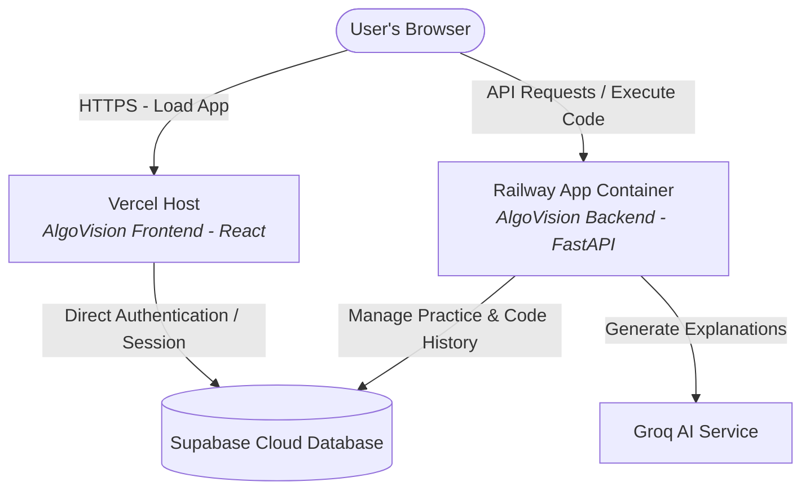

# 🚀 AlgoVision Cloud Deployment Guide

This guide provides a comprehensive comparison between **Render** and **Railway** for hosting the **AlgoVision Backend**, details why **Railway** is the superior choice for this specific architecture, and provides step-by-step instructions for deploying both the backend (Railway) and frontend (Vercel).

---

## 📊 Render vs. Railway: Head-to-Head Comparison

For the AlgoVision FastAPI backend, **Railway is the clear winner.** Here is a comparison explaining why:

| Feature / Criteria | 🟩 Render (Free Tier / Starter) | 🟣 Railway (Developer Plan / Free Trial) | Winner |
| :--- | :--- | :--- | :--- |
| **Cold Starts** | 🛑 **Aggressive Sleep**: Container spins down after 15 mins of inactivity. Waking up takes **50–90 seconds**, causing high latency for the first user. | ⚡ **Instant-On**: Containers do not sleep on paid plans ($5/mo starting), and start in seconds. | **Railway** |
| **Heavy Docker Build** | ⚠️ **Build Failures/Timeouts**: Installing `g++`, `default-jdk` (Java), and `nodejs` is extremely heavy. Render's free tier build has limited RAM (2GB) and CPU, causing potential build timeouts. | ✅ **High-Performance Builds**: Generous compilation resources and robust Docker caching ensure fast and successful builds. | **Railway** |
| **Docker Build Context** | ⚙️ **Manual Setup**: Setting the build context to the repository root while referencing `backend/Dockerfile` can be complex to configure. | 🎯 **Simple Configuration**: Allows you to specify the repository root `/` as the context and path to `/backend/Dockerfile` in a couple of clicks. | **Railway** |
| **Pricing Model** | 💲 Free tier available, but highly constrained (512MB RAM limit, sleep state). | 💲 Pay-as-you-go. Extremely cheap (often <$1/mo for low-traffic projects under the $5 credit threshold). | **Railway** |

> [!IMPORTANT]
> Because AlgoVision is a **sub-process-based code executor** compiling and running Java, C++, Python, and JS, the backend container must have system-level compilers. Running this heavy environment on Render's free tier will result in build failure due to memory/time constraints or severe runtime lag. **Railway is highly recommended.**

---

## 🗺️ Architectural Workflow

The following diagram illustrates how the deployed components interact:



---

## 🟣 Phase 1: Deploying the Backend on Railway

### 📋 Prerequisites
1. A **GitHub Repository** containing the AlgoVision codebase.
2. A **Railway Account** (linked with your GitHub).
3. A **Supabase Project** (for DB URL and Secret Key).
4. A **Groq API Key** (for code explanations).

### 🛠️ Step-by-Step Backend Setup

1. **Create a New Project on Railway**:
   * Go to [Railway.app](https://railway.app) and sign in.
   * Click **New Project** -> **Deploy from GitHub repo** and select your `AlgoVision` repository.

2. **Configure Dockerfile Path & Build Context**:
   * By default, Railway will detect the project. We need to tell it to build using the `backend/Dockerfile` while keeping the **root folder** as the build context.
   * Go to the newly created service's **Settings** tab.
   * Under **Build**, find **Dockerfile Path** and set it to:
     ```bash
     backend/Dockerfile
     ```
   * Ensure the **Root Directory** / **Build Context** is set to `/` (the repository root). This is critical because `backend/Dockerfile` copies dependencies from `backend/requirements.txt` relative to the workspace root.

3. **Add Environment Variables**:
   * Go to the **Variables** tab of your service.
   * Add the following environment variables:
     
     | Variable Name | Value / Description |
     | :--- | :--- |
     | `SUPABASE_URL` | Your Supabase Project URL (`https://xxx.supabase.co`) |
     | `SUPABASE_KEY` | Your Supabase service_role API Key (or Service Key) |
     | `GROQ_API_KEY` | Your Groq API Key |
     | `GROQ_MODEL` | `llama-3.3-70b-versatile` *(default)* |
     | `SECRET_KEY` | A long, secure random string for signing JWT tokens |
     | `DEBUG` | `False` *(for production)* |
     | `PORT` | `8000` *(Railway injects this, but specify it to be safe)* |

4. **Verify Port & Network settings**:
   * Go to **Settings** -> **Networking**.
   * Click **Generate Domain** to get a public HTTPS URL (e.g., `https://algovision-backend-production.up.railway.app`).
   * **Copy this URL!** You will need it for the frontend deployment.

---

## 🛜 Phase 2: Deploying the Frontend on Vercel

Vercel is the industry standard for Vite/React applications. It is free, has instant globally-distributed edge networking, and deploys automatically upon pushing code to GitHub.

### 🛠️ Step-by-Step Frontend Setup

1. **Create a New Vercel Project**:
   * Go to [Vercel.com](https://vercel.com) and log in.
   * Click **Add New** -> **Project**.
   * Import your `AlgoVision` GitHub repository.

2. **Configure Project Settings**:
   * **Framework Preset**: Select **Vite** (Vercel usually autodetects this).
   * **Root Directory**: Click *Edit* and select the `frontend` subfolder.
   * **Build & Development Settings**: Keep defaults (Build Command: `npm run build`, Output Directory: `dist`).

3. **Add Environment Variables**:
   * Expand the **Environment Variables** section.
   * Add the following variables (Vite requires `VITE_` prefix for client-side exposure):

     | Variable Name | Value |
     | :--- | :--- |
     | `VITE_API_BASE_URL` | **The Railway Backend URL** generated in Phase 1 (e.g., `https://algovision-backend-production.up.railway.app`) |
     | `VITE_SUPABASE_URL` | Your Supabase Project URL |
     | `VITE_SUPABASE_ANON_KEY` | Your Supabase `anon` public key (safe to expose client-side) |

4. **Deploy**:
   * Click **Deploy**. Vercel will install dependencies, compile the Tailwind-optimized bundles, and launch your site in under a minute!
   * Once finished, you will receive a production URL (e.g., `https://algovision.vercel.app`).

---

## ⚠️ Important Production Checklist

> [!WARNING]
> **1. CORS Configuration (Cross-Origin Resource Sharing)**
> Ensure the FastAPI backend permits requests from your Vercel URL. Check `backend/main.py` and verify `CORSMiddleware` allows either `*` (any origin) or lists your specific Vercel domain in `allow_origins`.

> [!TIP]
> **2. Environment Security**
> * Never push `.env` files to GitHub.
> * Always use the dashboard variable managers on Railway and Vercel.
> * In Supabase, make sure Row Level Security (RLS) is enabled on all tables that contain user data to protect from direct client manipulation.

> [!NOTE]
> **3. Testing Subprocess Execution**
> Once fully deployed, go to the "Practice" or "Compiler" workspace in your live frontend, write a basic script in C++ or Java, and run it. The Railway container will spin up the local `g++` or `javac` subprocess, execute your code safely inside the Linux container sandbox, and return output in milliseconds!
