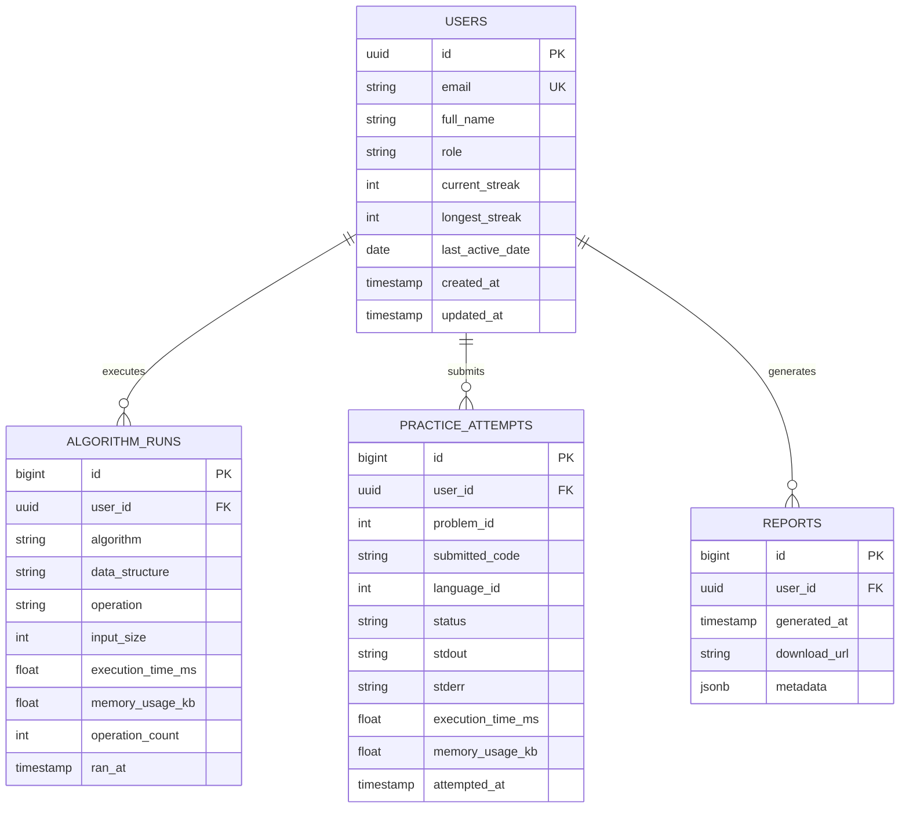

# AlgoVision Entity Relationship Diagram (ERD)

```mermaid
erDiagram
    USERS {
        uuid id PK
        string email UK
        string full_name
        string role
        int current_streak
        int longest_streak
        date last_active_date
        timestamp created_at
        timestamp updated_at
    }

    ALGORITHM_RUNS {
        bigint id PK
        uuid user_id FK
        string algorithm
        string data_structure
        string operation
        int input_size
        float execution_time_ms
        float memory_usage_kb
        int operation_count
        timestamp ran_at
    }

    PRACTICE_ATTEMPTS {
        bigint id PK
        uuid user_id FK
        int problem_id
        string submitted_code
        int language_id
        string status
        string stdout
        string stderr
        float execution_time_ms
        float memory_usage_kb
        timestamp attempted_at
    }

    REPORTS {
        bigint id PK
        uuid user_id FK
        timestamp generated_at
        string download_url
        jsonb metadata
    }

    USERS ||--o{ ALGORITHM_RUNS : "executes"
    USERS ||--o{ PRACTICE_ATTEMPTS : "submits"
    USERS ||--o{ REPORTS : "generates"
```
