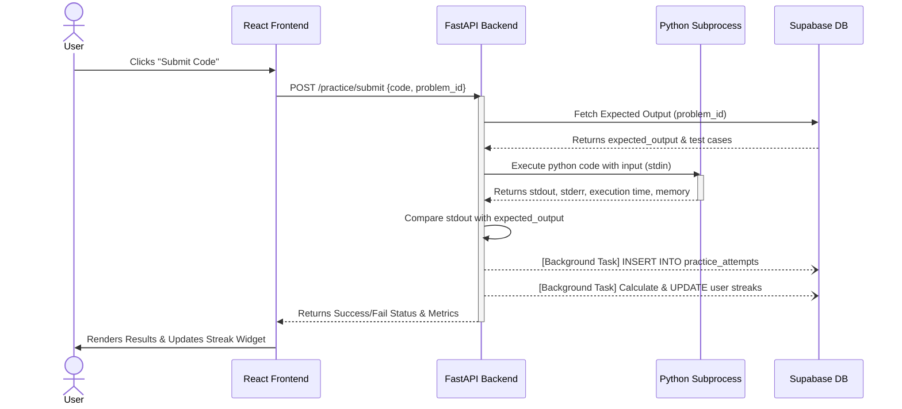
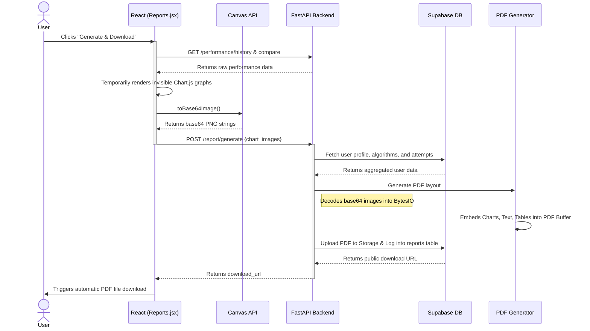
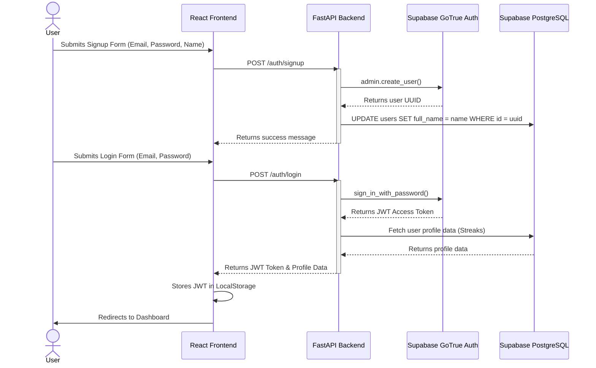
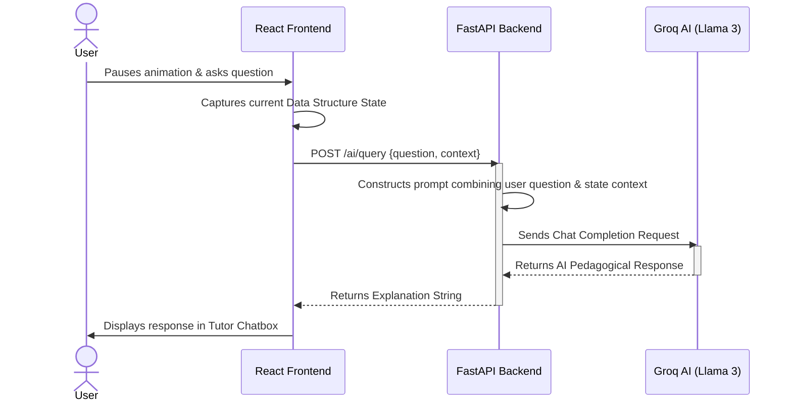
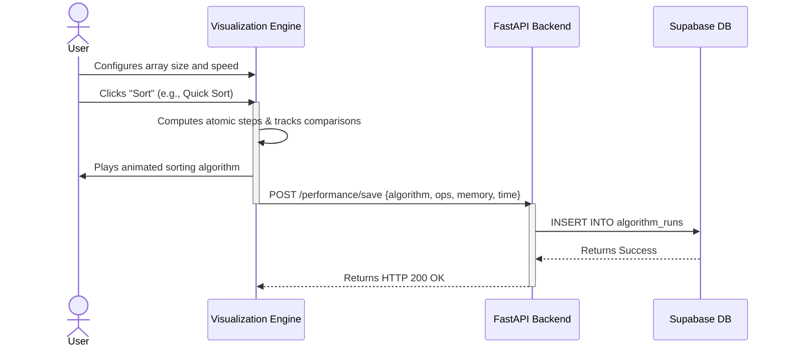

# AlgoVision Sequence Diagrams

## 1. Practice Problem Submission Sequence

This sequence diagram illustrates the complete flow when a user submits code for a practice problem, including local compilation and streak updating.

## 2. PDF Report Generation Sequence

This sequence diagram shows how off-screen chart rendering is used to generate a comprehensive PDF report.

## 3. Authentication Flow (Signup & Login)

## 4. AI Tutor Query Flow

## 5. Algorithm Visualization & Performance Logging Flow

