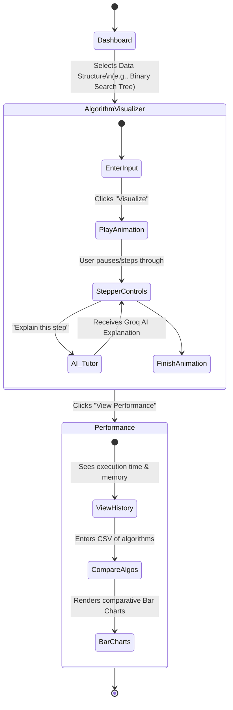
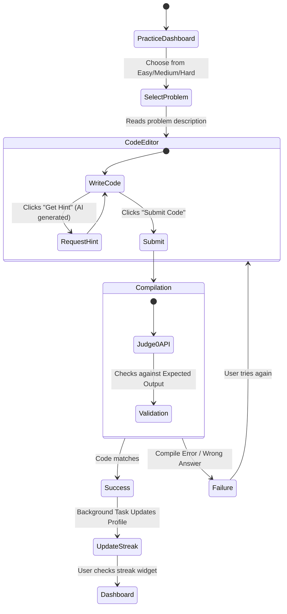

# AlgoVision User Flows

This document maps out the core user journeys within AlgoVision.

## 1. Core Learning Journey (Visualizer to Performance)

## 2. Practice & Evaluation Flow

## Detailed Text Walkthroughs

### **Scenario A: A New Student Learning Linked Lists**
1. **Sign Up**: The user creates an account. They are greeted by the Dashboard.
2. **Visualize**: They navigate to `Data Structures -> Linked List`. They input a series of numbers and click "Insert".
3. **Interactive Step**: The user watches the nodes link together. They don't understand pointers, so they pause the animation and type in the **AI Tutor** chat: *"Why did the 'next' pointer change to node 3?"*. The Groq AI model provides a contextual answer.
4. **Analytics**: After completing the insertion, the system logs the operation. The user goes to the **Performance** tab to see that the Linked List insertion took `O(1)` time at the head, comparing its graph directly with an Array insertion graph.

### **Scenario B: Preparing for Interviews**
1. **Practice Tab**: The user selects an "Easy" array problem.
2. **Coding**: They write a Python solution in the integrated code editor.
3. **Execution**: Clicking submit sends the code to the **Judge0 Compiler**. The code runs against hidden test cases.
4. **Validation & Streak**: It passes! The backend accepts the solution, updates the user's `current_streak` to 5 days, and visually updates the fire icon on their home dashboard.
5. **Reporting**: At the end of the week, the user visits the **Reports** tab and clicks "Generate PDF". The system compiles their practice accuracy, performance charts, and history into a downloadable PDF portfolio.
