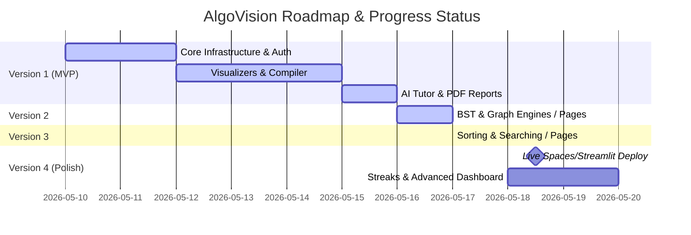

# AlgoVision — Reconciled Project Progress & Audit Report

This report presents a thorough audit of the **AlgoVision** repository, comparing the master vision in [idea.md](file:///c:/Users/hp/Documents/GitHub/AlgoVision--AI-Powered-Data-Structures-Learning-and-Analysis-System/docs/idea.md) and execution roadmap in [planning.md](file:///c:/Users/hp/Documents/GitHub/AlgoVision--AI-Powered-Data-Structures-Learning-and-Analysis-System/docs/planning.md) against the actual, implemented codebase.

---

## 📊 High-Level Status Summary

The AlgoVision system is in an **extremely advanced state of development**. The team has successfully implemented and integrated **Version 1 (Core MVP)**, **Version 2 (Trees & Graphs)**, and **Version 3 (Sorting & Searching)** across both the backend (FastAPI) and frontend (React), leaving only the deployment and final polishes in **Version 4** pending.

| Version | Title | Target Scope | Implementation Status | Completion % |
| :--- | :--- | :--- | :--- | :--- |
| **V1** | **Core MVP** | Basic Structures, Auth, AI Tutor, Compiler, Practice, PDF | **100% Completed** *(Fully Integrated)* | **100%** |
| **V2** | **Trees & Graphs** | BST, AVL Tree, Graphs (BFS/DFS), Node Visualizations | **100% Completed** *(AVL Rotations Implemented)* | **100%** |
| **V3** | **Sorting & Searching**| Bubble/Merge/Quick/etc., Binary Search, Algorithm Race Mode | **100% Completed** *(Race Mode Implemented)* | **100%** |
| **V4** | **Final Polish** | Cloud Deployment, Streaks, CI/CD | **20% Completed** *(Docker Production Ready)* | **20%** |

---

## 🔍 Detailed Version Breakdown

### 🟢 Version 1 — Core MVP (100% Completed)
*The primary foundation of the project is fully complete and operational.*

*   **Repository Structure**: The project structure adheres perfectly to the canonical architecture.
*   **Authentication Layer**: Fully operational with email/password signup and login connected directly to Supabase Auth. All endpoints verify JWTs via Supabase client dependencies.
    *   *Backend*: [auth.py](file:///c:/Users/hp/Documents/GitHub/AlgoVision--AI-Powered-Data-Structures-Learning-and-Analysis-System/backend/routers/auth.py) & [supabase_service.py](file:///c:/Users/hp/Documents/GitHub/AlgoVision--AI-Powered-Data-Structures-Learning-and-Analysis-System/backend/services/supabase_service.py).
    *   *Frontend*: [AuthContext.jsx](file:///c:/Users/hp/Documents/GitHub/AlgoVision--AI-Powered-Data-Structures-Learning-and-Analysis-System/frontend/src/context/AuthContext.jsx) with stateful persistence.
*   **Data Structure visualizers**:
    *   **Array**: Insert, Delete, and Search operations visualizer is complete.
        *   *Implementation*: [array_engine.py](file:///c:/Users/hp/Documents/GitHub/AlgoVision--AI-Powered-Data-Structures-Learning-and-Analysis-System/backend/algorithms/array_engine.py) & [ArrayVisualizer.jsx](file:///c:/Users/hp/Documents/GitHub/AlgoVision--AI-Powered-Data-Structures-Learning-and-Analysis-System/frontend/src/components/Visualizer/ArrayVisualizer.jsx).
    *   **Linked List**: Insert, Delete, and Search with pointer indicators (`head`, `current`, `new_node`).
        *   *Implementation*: [linkedlist_engine.py](file:///c:/Users/hp/Documents/GitHub/AlgoVision--AI-Powered-Data-Structures-Learning-and-Analysis-System/backend/algorithms/linkedlist_engine.py) & [LinkedListVisualizer.jsx](file:///c:/Users/hp/Documents/GitHub/AlgoVision--AI-Powered-Data-Structures-Learning-and-Analysis-System/frontend/src/components/Visualizer/LinkedListVisualizer.jsx).
*   **Code Execution Engine (Compiler)**:
    > [!NOTE]
    > **Architectural Migration Done**: The backend has decoupled from the external *Judge0* container API to resolve critical local development and network dependencies. It now relies on a highly robust **Local Subprocess-based Compiler** running natively in the Docker backend container environment, supporting Python, C++, Java, and JavaScript (Node.js).
    *   *Implementation*: [compiler_service.py](file:///c:/Users/hp/Documents/GitHub/AlgoVision--AI-Powered-Data-Structures-Learning-and-Analysis-System/backend/services/compiler_service.py), [compiler.py](file:///c:/Users/hp/Documents/GitHub/AlgoVision--AI-Powered-Data-Structures-Learning-and-Analysis-System/backend/routers/compiler.py), and [Compiler.jsx](file:///c:/Users/hp/Documents/GitHub/AlgoVision--AI-Powered-Data-Structures-Learning-and-Analysis-System/frontend/src/pages/Compiler.jsx).
*   **AI Tutor**: Seamless integration with the Groq API utilizing `llama3-70b-8192`. The AI behaves as a computer science tutor and responds dynamically to visualizer context.
    *   *Implementation*: [groq_service.py](file:///c:/Users/hp/Documents/GitHub/AlgoVision--AI-Powered-Data-Structures-Learning-and-Analysis-System/backend/services/groq_service.py) & [AITutor.jsx](file:///c:/Users/hp/Documents/GitHub/AlgoVision--AI-Powered-Data-Structures-Learning-and-Analysis-System/frontend/src/pages/AITutor.jsx).
*   **Practice Problems**: A total of 10 initial problems loaded, allowing submissions verified in real-time by the compiler, supporting automatic state updates in Supabase.
    *   *Implementation*: [seed.sql](file:///c:/Users/hp/Documents/GitHub/AlgoVision--AI-Powered-Data-Structures-Learning-and-Analysis-System/database/seed.sql), [practice.py](file:///c:/Users/hp/Documents/GitHub/AlgoVision--AI-Powered-Data-Structures-Learning-and-Analysis-System/backend/routers/practice.py), and [Practice.jsx](file:///c:/Users/hp/Documents/GitHub/AlgoVision--AI-Powered-Data-Structures-Learning-and-Analysis-System/frontend/src/pages/Practice.jsx).
*   **Performance Metrics & Reports**: Execution time, memory footprint (`tracemalloc`), and operations count are logged and charted via Chart.js. Progress reports can be compiled into downloadable PDFs using ReportLab.
    *   *Implementation*: [report_service.py](file:///c:/Users/hp/Documents/GitHub/AlgoVision--AI-Powered-Data-Structures-Learning-and-Analysis-System/backend/services/report_service.py), [report.py](file:///c:/Users/hp/Documents/GitHub/AlgoVision--AI-Powered-Data-Structures-Learning-and-Analysis-System/backend/routers/report.py), and [Reports.jsx](file:///c:/Users/hp/Documents/GitHub/AlgoVision--AI-Powered-Data-Structures-Learning-and-Analysis-System/frontend/src/pages/Reports.jsx).
*   **Docker Scaffold**: Docker Compose is fully configured. It is production-ready, featuring environment arguments and building using multi-stage Node + Nginx setups for static assets delivery on port `5173`.

---

### 🌳 Version 2 — Trees & Graphs (100% Completed)
*All planned features are complete including full AVL self-balancing with rotation animations.*

*   **State Generation Engines**: The backend algorithms compute state sequences for BST and AVL insertions, deletions, search, and BFS/DFS traversals.
    *   *Implementation*: [bst_engine.py](file:///c:/Users/hp/Documents/GitHub/AlgoVision--AI-Powered-Data-Structures-Learning-and-Analysis-System/backend/algorithms/bst_engine.py), [avl_engine.py](file:///c:/Users/hp/Documents/GitHub/AlgoVision--AI-Powered-Data-Structures-Learning-and-Analysis-System/backend/algorithms/avl_engine.py) & [graph_engine.py](file:///c:/Users/hp/Documents/GitHub/AlgoVision--AI-Powered-Data-Structures-Learning-and-Analysis-System/backend/algorithms/graph_engine.py).
*   **API Routers**: All routers connected and mapped inside [main.py](file:///c:/Users/hp/Documents/GitHub/AlgoVision--AI-Powered-Data-Structures-Learning-and-Analysis-System/backend/main.py).
    *   *Implementation*: [bst.py](file:///c:/Users/hp/Documents/GitHub/AlgoVision--AI-Powered-Data-Structures-Learning-and-Analysis-System/backend/routers/bst.py), [avl.py](file:///c:/Users/hp/Documents/GitHub/AlgoVision--AI-Powered-Data-Structures-Learning-and-Analysis-System/backend/routers/avl.py) & [graph.py](file:///c:/Users/hp/Documents/GitHub/AlgoVision--AI-Powered-Data-Structures-Learning-and-Analysis-System/backend/routers/graph.py).
*   **Frontend UI and Visualizers**: BST, AVL, and Graph tabs in a single page. BSTVisualizer now renders balance-factor rings (colour-coded by |bf|), rotation type badges (LL/RR/LR/RL), and distinct orange/purple glow highlights for imbalance and rotation frames.
    *   *Implementation*: [BSTVisualizer.jsx](file:///c:/Users/hp/Documents/GitHub/AlgoVision--AI-Powered-Data-Structures-Learning-and-Analysis-System/frontend/src/components/Visualizer/BSTVisualizer.jsx), [GraphVisualizer.jsx](file:///c:/Users/hp/Documents/GitHub/AlgoVision--AI-Powered-Data-Structures-Learning-and-Analysis-System/frontend/src/components/Visualizer/GraphVisualizer.jsx), and [TreesGraphs.jsx](file:///c:/Users/hp/Documents/GitHub/AlgoVision--AI-Powered-Data-Structures-Learning-and-Analysis-System/frontend/src/pages/TreesGraphs.jsx).
*   **AVL Rotations — Fully Animated** ✅
    *   All four rotation cases (LL, RR, LR, RL) produce discrete animation frames showing the unbalanced state (orange glow) followed by the rotated balanced state (purple glow).
    *   Every node displays its live **balance factor** (`bf = height(L) − height(R)`) rendered inside the SVG with colour coding: 🟢 green (0), 🟡 yellow (±1), 🟠 orange (>1 — violation).
    *   AVL Insert/Delete/Search/Traversal operations persist tree state across operations identically to BST.

---

### 🔢 Version 3 — Sorting & Searching (100% Completed)
*All planned features including the live Algorithm Race Mode are fully implemented.*

*   **State Generation Engine**: State snapshot sequences are fully configured for all main sorting routines (Bubble, Selection, Insertion, Merge, Quick) and searching (Linear/Binary).
    *   *Implementation*: [sorting_engine.py](file:///c:/Users/hp/Documents/GitHub/AlgoVision--AI-Powered-Data-Structures-Learning-and-Analysis-System/backend/algorithms/sorting_engine.py).
*   **API Router**: Fully mapped inside [main.py](file:///c:/Users/hp/Documents/GitHub/AlgoVision--AI-Powered-Data-Structures-Learning-and-Analysis-System/backend/main.py).
    *   *Implementation*: [sorting.py](file:///c:/Users/hp/Documents/GitHub/AlgoVision--AI-Powered-Data-Structures-Learning-and-Analysis-System/backend/routers/sorting.py).
*   **Frontend UI and Visualizers**: Visualizes bar sorting charts with speed and comparison highlighting, mapping indices and values dynamically.
    *   *Implementation*: [SortingVisualizer.jsx](file:///c:/Users/hp/Documents/GitHub/AlgoVision--AI-Powered-Data-Structures-Learning-and-Analysis-System/frontend/src/components/Visualizer/SortingVisualizer.jsx) & [SortingSearch.jsx](file:///c:/Users/hp/Documents/GitHub/AlgoVision--AI-Powered-Data-Structures-Learning-and-Analysis-System/frontend/src/pages/SortingSearch.jsx).
*   **Algorithm Race Mode — Fully Implemented** ✅
    *   The `/sorting/race` backend endpoint now returns both performance metrics **and** full per-algorithm `states[]` arrays, enabling real-time animation.
    *   The frontend Race tab features a **live split-screen visualizer**: two `SortingVisualizer` panels rendered side-by-side with their state arrays padded to the same length so they advance in lockstep.
    *   A **shared playback toolbar** (Play/Pause, Step Back/Forward, Reset, Speed selector 0.5×–5×, scrubber slider) controls both panels simultaneously.
    *   A per-algorithm **progress bar** tracks how far each algorithm has advanced relative to its own total step count.
    *   After the race completes, a **performance table** (time, memory, operations — sorted by fewest ops with 🏆 winner) and a **Chart.js bar chart** display a full comparative breakdown for all selected algorithms.

---

### 🔮 Version 4 — Final Polish (20% Completed)
*The final polish items are pending implementation as the team completes visual features.*

*   **Completed**:
    *   Containerization for Nginx-based production deployment is complete.
*   **Pending**:
    *   **Cloud Deployment**: Live deployment configurations on HuggingFace Spaces or Streamlit.
    *   **CI/CD Pipeline**: GitHub actions for automated code syntax testing and automatic compilation.
    *   **User Streaks**: Storing consecutive day practices inside the DB and rendering a dashboard widget.
    *   **Graphs inside PDF**: While the PDF report exports tables and summaries perfectly, embedding direct Chart.js canvas snapshots into ReportLab flowables remains pending.

---

## 🛠️ Codebase Validation Matrix

| Target File | System Role | Planning Status | Implementation Verification |
| :--- | :--- | :--- | :--- |
| `backend/main.py` | API Entrypoint | Scaffolded | **Completed**: Includes all routers including V2 and V3. |
| `backend/algorithms/*_engine.py` | Stateful Math | Core Engine | **Completed**: Reconciles and computes state snapshots for Arrays, LLs, BSTs, Graphs, and Sorting. |
| `backend/services/compiler_service.py` | Local execution | Judge0 Replacement | **Completed**: Handles sandboxed subprocesses natively within Docker container. |
| `backend/services/groq_service.py` | AI Chat Client | AI Tutor | **Completed**: Connected to LLaMA 3. Generates follow-up question schemas. |
| `frontend/src/App.jsx` | Client Router | Skeleton | **Completed**: Fully wired routes with authentication checks. |
| `frontend/src/components/Navbar.jsx` | App Shell Navigation | Skeleton | **Completed**: Fully styled navbar with icons mapping to all core features. |

---

## 💡 Key Findings & Recommendations

> [!TIP]
> **Extremely High Code Quality**: The project structure is incredibly organized and complies completely with the strict global rules laid out in [planning.md](file:///c:/Users/hp/Documents/GitHub/AlgoVision--AI-Powered-Data-Structures-Learning-and-Analysis-System/docs/planning.md). 
> 
> **Next Recommended Steps**:
> 1. Complete the V4 cloud hosting parameters.
> 2. Implement the **CI/CD Pipeline** files inside `.github/workflows/`.
> 3. Enhance the PDF reporting service to parse and render base64 charts from the UI.
